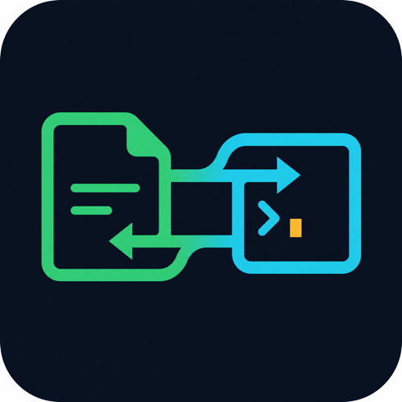
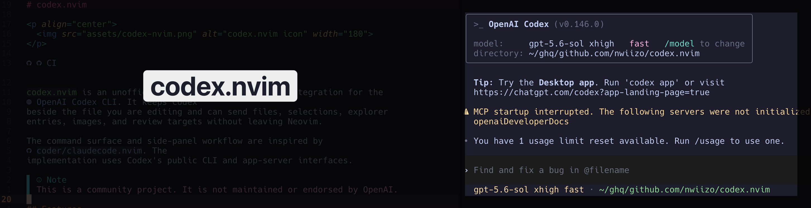

# codex.nvim

<p align="center">
  
</p>

[](https://github.com/nwiizo/codex.nvim/actions/workflows/ci.yml)

`codex.nvim` is an unofficial, dependency-free Neovim integration for the
[OpenAI Codex CLI](https://developers.openai.com/codex/cli/). It keeps Codex
beside the file you are editing and can send files, selections, explorer
entries, images, and review targets without leaving Neovim.

The command surface and side-panel workflow are inspired by
[`coder/claudecode.nvim`](https://github.com/coder/claudecode.nvim). The
implementation uses Codex's public CLI and app-server interfaces.

> [!NOTE]
> This is a community project. It is not maintained or endorsed by OpenAI.

<p align="center">
  
</p>

## Features

- Pure Lua with no runtime plugin dependencies
- Neovim 0.12-native APIs and shell-free argv execution
- Interactive Codex terminal that survives window hiding
- Smart focus: reveal a hidden session, jump to a visible session, or hide it
  and return to the most recent editor window when already focused
- Configurable terminal-to-window navigation, defaulting to `Alt-h/j/k/l`
- Working directory policies centered on the active file or project root
- Resume, continue, fork, review, image, and interrupt workflows
- Exact line, characterwise, linewise, and blockwise selection context
- File/directory references from nvim-tree, neo-tree, Oil, mini.files, netrw,
  and Snacks picker lists
- Status receipts for the last file or selection handed to the active session
- Optional app-server backend with streamed Markdown, approval prompts, plans,
  and native diff buffers
- `:checkhealth codex` diagnostics and `User` autocmd lifecycle events

## Requirements

- Neovim 0.12+
- [Codex CLI](https://developers.openai.com/codex/cli/) on `PATH`
- macOS or Linux

## Installation

With lazy.nvim:

```lua
{
  "nwiizo/codex.nvim",
  cmd = {
    "Codex",
    "CodexOpen",
    "CodexFocus",
    "CodexResume",
    "CodexContinue",
    "CodexFork",
    "CodexReview",
    "CodexImage",
    "CodexPrompt",
    "CodexSend",
    "CodexSendVisual",
    "CodexAddVisual",
    "CodexAdd",
    "CodexTreeAdd",
    "CodexDiff",
    "CodexInterrupt",
    "CodexStatus",
    "CodexStop",
    "CodexHealth",
  },
  opts = {},
}
```

For local development, replace the repository string with `dir =
"/path/to/codex.nvim"` and add `name = "codex.nvim"`.

## Quick start

Open or toggle Codex:

```vim
:Codex
```

Add the current file to the composer without submitting:

```vim
:CodexAdd
```

Insert an exact visual selection without submitting, then finish the prompt
inside Codex:

```vim
:'<,'>CodexAddVisual
```

Send an exact visual selection:

```vim
:'<,'>CodexSendVisual
```

Add marked or selected explorer entries:

```vim
:CodexTreeAdd
```

A compact keymap setup:

```lua
keys = {
  { "<leader>ax", "<cmd>CodexFocus<cr>", desc = "Focus or hide Codex" },
  { "<leader>ab", "<cmd>CodexAdd<cr>", desc = "Add current buffer to Codex" },
  {
    "<leader>aa",
    ":<C-U>CodexAddVisual<CR>",
    mode = "v",
    desc = "Add selection to Codex prompt",
  },
  {
    "<leader>as",
    ":<C-U>CodexSendVisual<CR>",
    mode = "v",
    desc = "Send selection to Codex",
  },
}
```

`CodexFocus` behaves according to where the Codex window is:

| State | Result |
| --- | --- |
| Running but hidden | Reopen and focus it |
| Visible in another window | Move focus to it |
| Already focused | Hide it without stopping the process |
| Not running | Start and focus a new session |

Hiding the panel from inside it restores the most recent non-Codex window when
that window still exists.

Inside the terminal, `Alt-h`, `Alt-j`, `Alt-k`, and `Alt-l` leave terminal mode
and move to the neighboring Neovim window.
If your terminal emulator does not send Option/Alt as Meta, configure different
keys with `terminal.window_navigation`.

## Commands

| Command | Description |
| --- | --- |
| `:Codex [args...]` | Toggle the selected backend; start `codex [args...]` when absent |
| `:CodexOpen [args...]` | Show the selected backend; start Codex when absent |
| `:CodexClose` | Hide the window without stopping Codex |
| `:CodexFocus` | Focus a visible/hidden session, or hide it when already focused |
| `:CodexStop` | Stop the Codex process |
| `:CodexResume [--all\|session]` | Pick or resume a prior session |
| `:CodexContinue` | Resume the most recent session |
| `:CodexFork [--all\|session]` | Pick or fork a prior session |
| `:CodexReview [--uncommitted\|--base BRANCH\|--commit SHA\|instructions]` | Review a change target |
| `:CodexImage {path...}` | Start a Codex session/turn with local images |
| `:CodexPrompt [text]` | Prompt Codex, using `vim.ui.input` when text is omitted |
| `:[range]CodexSend` | Send complete lines with file and range context |
| `:'<,'>CodexSendVisual` | Send the exact visual selection |
| `:'<,'>CodexAddVisual` | Insert the exact visual selection without submitting |
| `:CodexAdd [path]` | Insert an `@path` reference without submitting |
| `:[range]CodexTreeAdd` | Insert selected explorer paths without submitting |
| `:CodexSendText[!] {text}` | Send and submit text; bang only inserts it |
| `:CodexDiff` | Show the latest app-server diff in a native diff buffer |
| `:CodexInterrupt` | Interrupt the active app-server turn |
| `:CodexStatus` | Show backend, process, cwd, and the last context receipt |
| `:CodexHealth` | Run `:checkhealth codex` |

Starting a separate terminal review, image, resume, or fork command does not
replace an active terminal process. Stop or exit the current session first.
When no session ID is supplied, `CodexResume` and `CodexFork` briefly use
app-server `thread/list` to provide `vim.ui.select` pickers even with the
terminal backend. Supply a session ID to use the terminal CLI directly.

## Configuration

```lua
require("codex").setup({
  backend = "terminal", -- "terminal" or "app_server"
  cmd = { "codex" },
  env = {}, -- passed to terminal and app-server processes

  -- "root", "file", "nvim", a directory path, or function(ctx)
  cwd = "root",
  root_markers = { ".git" },
  focus_after_send = false, -- applies to both backends

  terminal = {
    layout = "split", -- "split" or "float"
    split_side = "right",
    split_width_percentage = 0.35,
    float = {
      width_percentage = 0.85,
      height_percentage = 0.85,
      border = "rounded",
    },
    auto_insert = true,
    auto_close = true,
    hide_keys = {}, -- terminal-local keys that hide Codex
    window_navigation = {
      left = "<M-h>",
      down = "<M-j>",
      up = "<M-k>",
      right = "<M-l>",
    },
  },

  context = {
    max_lines = 500,
    max_bytes = 65536,
  },

  app_server = {
    cmd = { "codex", "app-server" },
  },
})
```

For a named Codex profile:

```lua
cmd = { "codex", "--profile", "work" },
app_server = {
  cmd = { "codex", "--profile", "work", "app-server" },
},
```

Configure both commands so the native backend and terminal resume/fork pickers
list sessions from the same profile.

Set `terminal.window_navigation = false` to disable all four terminal-local
mappings.

For a centered floating Codex TUI with terminal-local hide keys:

```lua
terminal = {
  layout = "float",
  float = {
    width_percentage = 0.85,
    height_percentage = 0.85,
    border = "rounded",
  },
  hide_keys = { "<C-/>", "<C-_>" },
}
```

The hide mappings are buffer-local, so the same keys keep their existing
behavior in editor and other terminal buffers. `<C-/>` and `<C-_>` cover the
two encodings commonly produced for Ctrl-/ by terminals and multiplexers.

### Working directory policy

The default `cwd = "root"` starts Codex from the nearest directory containing a
root marker for the file that was active when the session started. When no root
is found, it falls back to the file's directory, then Neovim's cwd. For example,
opening `github.com/nwiizo/codex.nvim/lua/codex/init.lua` in the standalone
repository starts Codex from `github.com/nwiizo/codex.nvim`. Use `cwd = "file"`
when the file's own `lua/codex` directory should always win.

| Value | Resolution |
| --- | --- |
| `"root"` | Nearest configured root marker from the active file |
| `"file"` | Active file's directory |
| `"nvim"` | Neovim's current working directory |
| `"/fixed/path"` | Explicit directory |
| `function(ctx)` | Custom directory chosen from buffer context |

The callback receives `bufnr`, `file`, `file_dir`, and `nvim_cwd`:

```lua
cwd = function(ctx)
  return vim.fs.root(ctx.file or ctx.nvim_cwd, { "Makefile", ".git" })
    or ctx.file_dir
    or ctx.nvim_cwd
end
```

The resolved cwd is fixed for the lifetime of a running session. Stop it before
restarting from a different file or root.

## Backends

### Terminal (default)

The terminal backend runs the complete interactive Codex TUI. It is the
recommended default because Codex owns the conversation UI and approval flow.
Closing its split or float only hides the buffer; `:CodexStop` stops the
process. The split side and width under `terminal` are also reused by the
app-server panel. Argument-free resume/fork pickers depend on app-server; pass a
session ID to run those terminal commands without the picker protocol.

### App-server (experimental)

```lua
opts = { backend = "app_server" }
```

The app-server backend starts `codex app-server` over stdio JSONL and provides a
native Markdown transcript, streamed agent messages, thread pickers, plan and
command output, approval and permission prompts through `vim.ui.select`, user
input requests, and diff buffers. MCP elicitation can be declined or cancelled;
client-defined dynamic tools and external token/attestation providers are not
advertised or implemented. The upstream app-server API is experimental and may
change. The terminal TUI can still be used if a Codex CLI update changes the
protocol; pass explicit session IDs instead of using its app-server-backed
resume/fork pickers.

## Explorer integration

Run `:CodexTreeAdd` from a supported explorer buffer. No explorer is installed
or required by codex.nvim.

| Explorer | Selection behavior |
| --- | --- |
| nvim-tree | Marks, then the node under the cursor |
| neo-tree | Visual range/selection, then the current node |
| Oil | Visual range or cursor entry |
| mini.files | Visual range or cursor entry |
| netrw | Marked files or cursor entry |
| Snacks picker | Selected items, with the current item as fallback |

Paths are canonicalized, deduplicated, checked for existence, and sent relative
to the running Codex cwd when possible.

## Events

The plugin emits these `User` autocmds. Payloads are available in `event.data`.

| Pattern | When |
| --- | --- |
| `CodexStarted` | A terminal process starts |
| `CodexExited` | A terminal process exits |
| `CodexOpened` | A hidden terminal becomes visible |
| `CodexClosed` | A terminal window is hidden |
| `CodexContextSent` | A file, range, or visual selection is sent |
| `CodexPathsSent` | One or more explorer/command paths are sent |
| `CodexAppServerReady` | The app-server initialize handshake completes |
| `CodexAppServerExited` | The app-server process exits |
| `CodexThreadStarted` | A new app-server thread starts |
| `CodexTurnStarted` | An app-server turn starts |
| `CodexTurnCompleted` | An app-server turn finishes |
| `CodexDiffUpdated` | The latest app-server turn diff changes |

Terminal payloads include process/window metadata. Context payloads include
kind, file path, line numbers when applicable, cwd, and whether the context was
inserted into the composer or submitted. `:CodexStatus` retains only this
metadata for the active session, not the selected source text. The `source`
field identifies the buffer, explorer, range, or visual-selection origin.
App-server payloads include thread/turn identifiers and event-specific data.

## Design boundaries

- One Codex process/thread is managed per Neovim instance.
- Context over `context.max_lines` or `context.max_bytes` is rejected instead of
  silently truncated.
- The plugin does not persist a second transcript; Codex remains the source of
  truth for session history.
- Windows is not currently supported.

## Development

```sh
make test          # headless unit/behavior suite
make integration   # initialize the installed Codex app-server and list threads
make fmt-check
make lint
make check
```

LuaLS reads `.luarc.json`; CI runs formatting, type diagnostics, and the test
suite against Neovim 0.12, stable, and nightly.

## License

Friend License (MIT-equivalent).
